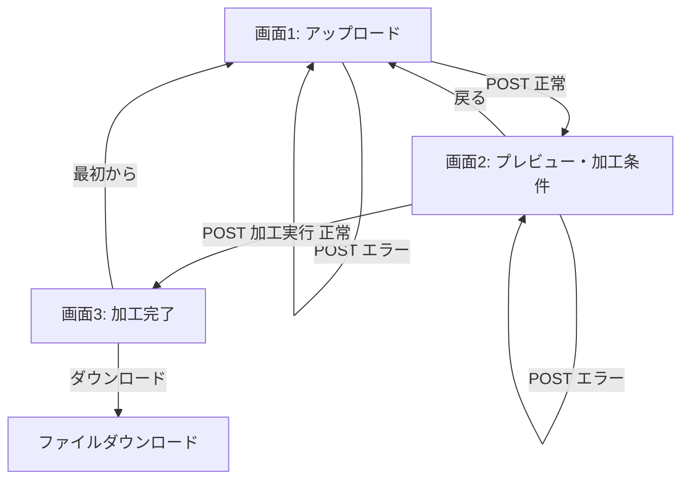

# CSV加工ツール Ver.1 設計書

## 1. システム概要

CSV加工ツール Ver.1 は、ブラウザ上で CSV ファイルをアップロードし、列の抽出・不要行の削除・文字コード変換を行ったうえで、加工後 CSV をダウンロードできる小規模 Web アプリケーションである。

本番公開を前提とした大規模サービスではなく、**Ruby on Rails による小規模 Web アプリを設計から公開まで完走する**ことを主目的とする。

### 技術スタック（採用版）

| 項目 | 採用 |
|------|------|
| 言語 | Ruby 3.3.x（推奨: 3.3.6 以上） |
| フレームワーク | Ruby on Rails 7.2.x |
| データベース | SQLite（Rails デフォルト。Ver.1 では CSV 内容は保存しない） |
| テンプレート | ERB |
| UI | Bootstrap 5（importmap + cssbundling または CDN） |
| CSV 処理 | Ruby 標準ライブラリ `CSV` |
| テスト | Minitest + Rails 標準テストヘルパー |
| バージョン管理 | Git / GitHub |
| 開発環境 | Docker + Docker Compose |

#### Rails 7.2 を採用する理由

- 2026 年時点でも安定して利用実績が多い LTS 的な位置づけ
- 学習リソースが豊富で、個人開発の初完走に適する
- Ver.1 に必要な機能（Active Storage 不使用、セッション、Strong Parameters 等）はすべて標準で提供される
- Rails 8 も選択肢だが、本プロジェクトでは「完走優先」のため、より実績のある 7.2 を推奨する

#### 開発環境について

**Docker + Docker Compose で開発環境を構築する**（2026-08 方針変更）。

| ホスト（WSL2 等）に必要なもの | コンテナ内で用意するもの |
|------------------------------|-------------------------|
| Docker Engine / Docker Compose | Ruby 3.3.x |
| Git | Rails 7.2.x / Bundler |
| ブラウザ | Node.js（Bootstrap ビルド用、必要時） |
| | SQLite / ビルド依存パッケージ |

**採用理由:**

- ホスト OS に Ruby / rbenv / ビルド依存を入れず、開発環境を軽量に保てる
- チームメンバー・将来の自分が `docker compose up` で同じ環境を再現できる
- Ver.1 のアプリ本体は従来どおり Rails 標準構成のまま（アプリコードに Docker 依存を入れない）

**スコープの線引き:**

- **対象**: 開発・テスト実行のための Docker 化
- **対象外**: 本番環境への Docker デプロイ、AWS 等クラウド構成（引き続き Ver.1 では実装しない）

#### 開発環境確認結果（Step 1）

現時点の WSL2 (Ubuntu 24.04) 環境では **Ruby / Rails / Bundler は未インストール**。Git 2.43.0 は利用可能。Docker の有無は実装開始時（T-001）に確認する。

---

## 2. 開発目的

- CSV 加工という具体的な題材を通じて、Rails アプリを **設計 → 実装 → テスト → 公開** まで経験する
- 60〜70 点でも **最後まで公開する** ことを優先する
- 責務分離と読みやすさを重視し、将来の機能追加に備えた最小限の構成とする

---

## 3. 対象ユーザー

- CSV を簡単に加工したい一般ユーザー（非エンジニアを含む）
- 開発者本人（Rails 学習・ポートフォリオ用途）

---

## 4. ユースケース

### UC-1: CSV をアップロードして内容を確認する

1. ユーザーがトップ画面で CSV ファイルを選択する
2. アップロードボタンを押す
3. システムがファイルを検証し、プレビュー画面へ遷移する
4. ヘッダー、先頭 10 行、総行数・総列数、推定文字コード、元ファイル名が表示される

### UC-2: 列を抽出して CSV をダウンロードする

1. プレビュー画面で出力列を複数選択する
2. 行削除条件・出力文字コードを指定する
3. 加工実行ボタンを押す
4. 加工結果概要画面が表示される
5. ダウンロードボタンで加工後 CSV を取得する

### UC-3: エラーが発生した場合

1. 検証・加工・変換の各段階でエラーが発生する
2. ユーザー向けに分かりやすいメッセージを画面表示する
3. 詳細はサーバーログに記録する（個人情報・CSV 全文は含めない）

---

## 5. Ver.1 の対象範囲

| 機能 | 対象 |
|------|------|
| CSV アップロード（.csv のみ） | ○ |
| ファイル検証（サイズ・形式・ヘッダー） | ○ |
| プレビュー（先頭 10 行） | ○ |
| 列の複数選択・抽出 | ○ |
| 完全空行の削除 | ○ |
| 指定列が空欄の行の削除 | ○ |
| 文字コード判定（UTF-8 / UTF-8 BOM / Windows-31J） | ○ |
| 出力文字コード選択（UTF-8 / UTF-8 BOM / Windows-31J） | ○ |
| 加工結果概要表示 | ○ |
| 加工後 CSV ダウンロード | ○ |
| エラー・警告表示 | ○ |
| 基本テスト | ○ |
| README | ○ |
| Docker 開発環境 | ○ |

---

## 6. 対象外機能

以下は Ver.1 では実装しない。

- ユーザー登録・ログイン・権限管理
- ファイル・加工履歴の DB 保存
- Excel / PDF 対応
- 複数 CSV 結合・比較
- 重複行削除、列名変更、列順 D&D
- 条件式フィルタ、日付・数値変換
- AI 機能、API 公開、非同期処理
- 大容量ファイル対応（5MB 超）
- AWS 本番デプロイ、本番用 Docker 構成、課金

※ **開発環境の Docker 化は Ver.1 の対象に含める**（ホストを汚さないため）

---

## 7. 画面一覧

| 画面 | パス（案） | 説明 |
|------|-----------|------|
| 画面1: CSV アップロード | `GET/POST /` | ファイル選択・アップロード |
| 画面2: プレビュー・加工条件 | `GET/POST /csv_files/:token/preview` | プレビューと加工条件入力 |
| 画面3: 加工完了 | `GET /csv_files/:token/result` | 結果概要とダウンロード |
| ダウンロード | `GET /csv_files/:token/download` | 加工後 CSV ファイル送信 |

---

## 8. 画面遷移



---

## 9. 処理フロー

### 9.1 アップロード〜プレビュー

```
1. ユーザーが CSV を POST
2. CsvUploadForm で入力検証（選択有無・拡張子・サイズ）
3. 一時ファイルへ保存（SecureRandom UUID 名）
4. CsvEncodingDetector で文字コード判定 → UTF-8 内部表現へ
5. CsvReader で CSV 解析・ヘッダー検証
6. プレビューデータ・メタ情報を生成
7. セッションに token・メタ情報を保存
8. プレビュー画面を表示
```

### 9.2 加工〜ダウンロード

```
1. ユーザーが加工条件を POST
2. セッション token で一時ファイルを特定
3. CsvReader で再読み込み
4. 加工条件のバリデーション（列存在・出力列 1 件以上）
5. CsvProcessor で列抽出・行削除
6. 加工後 0 件チェック
7. CsvWriter で指定 encoding の CSV 生成
8. CsvProcessingResult に統計・警告を格納
9. 結果をセッション／一時ファイルに保存
10. 結果画面表示
11. ダウンロード要求時に send_data / send_file
```

---

## 10. クラス構成

### 10.1 採用クラス一覧

| クラス | 配置 | 役割 |
|--------|------|------|
| `CsvUploadForm` | `app/forms/` | アップロード入力の受け取り・検証 |
| `CsvProcessingForm` | `app/forms/` | 加工条件入力の受け取り・検証 |
| `CsvFileValidator` | `app/services/csv_tool/` | 拡張子・サイズ・空ファイル等の検証 |
| `CsvEncodingDetector` | `app/services/csv_tool/` | 入力文字コード判定 |
| `CsvReader` | `app/services/csv_tool/` | CSV 読み込み・プレビュー生成 |
| `CsvProcessor` | `app/services/csv_tool/` | 列抽出・行削除 |
| `CsvWriter` | `app/services/csv_tool/` | 文字コード変換・CSV 出力 |
| `CsvProcessingResult` | `app/models/` または `app/services/csv_tool/` | 加工結果の値オブジェクト |
| `CsvTempfileStore` | `app/services/csv_tool/` | 一時ファイルの保存・取得・削除 |
| `CsvFilesController` | `app/controllers/` | HTTP リクエストのオーケストレーション |
| `CsvTool::Error` 系 | `app/services/csv_tool/errors.rb` | ドメイン例外（ユーザー向けメッセージ付き） |

### 10.2 クラス追加・変更の理由

**CsvProcessingForm を追加**

- 加工条件（選択列、削除条件、出力 encoding）の Strong Parameters とバリデーションを Controller から分離するため
- `CsvUploadForm` と対称的な構成にし、入力検証責務を明確化

**CsvTempfileStore を追加**

- 一時ファイルの生成・削除・token 管理を Controller や Reader から分離
- セッションとファイルシステムの橋渡しを 1 箇所に集約

**CsvTool::Error 系を追加**

- 例外メッセージをそのまま画面表示しない方針のため、ユーザー向けメッセージと内部原因を分離

### 10.3 各クラスの責務

#### CsvUploadForm

- `ActionDispatch::Http::UploadedFile` の受け取り
- ファイル未選択・拡張子・サイズ上限（5MB）の検証
- `CsvFileValidator` への委譲

#### CsvFileValidator

- 拡張子 `.csv`（大文字小文字無視）
- ファイルサイズ ≤ 5MB
- MIME タイプは参考情報のみ（信用しない）
- 空ファイルの検出

#### CsvEncodingDetector

- BOM 検出（UTF-8 BOM）
- UTF-8 妥当性チェック
- Windows-31J（Shift_JIS 相当）の試行デコード
- 判定不能時は `CsvTool::EncodingDetectionError` を raise
- 内部処理はすべて UTF-8 文字列に統一

#### CsvReader

- `CSV.parse` / `CSV.foreach` による読み込み
- ヘッダー行の存在確認
- ヘッダー名の前後空白トリム（データ行はそのまま）
- プレビュー用先頭 10 行の抽出
- 総行数・総列数の算出
- 不正 CSV は `CsvTool::InvalidCsvError`

#### CsvProcessor

- 選択列のみ抽出（元 CSV の列順を維持）
- 完全空行削除（すべてのセルが空または nil）
- 指定列が空欄（nil / 空文字 / 空白のみ）の行削除
- 存在しない列指定時は `CsvTool::ColumnNotFoundError`
- 出力列未選択時は `CsvTool::NoColumnsSelectedError`

#### CsvWriter

- 内部 UTF-8 データを指定 encoding へ変換
- UTF-8 BOM 付与
- Windows-31J 変換不能文字の処理（後述）
- Tempfile または StringIO で出力バイナリ生成

#### CsvProcessingResult

- `rows_before`, `rows_after`, `rows_removed`, `columns_count`
- `output_encoding`, `warnings`（配列）
- `output_path` または `output_token`
- `original_filename`

#### CsvFilesController

- 画面表示・リダイレクト・flash メッセージ
- 各サービスクラスの呼び出し順序の制御
- 例外を rescue し、ユーザー向けメッセージへ変換
- Strong Parameters の適用

---

## 11. ディレクトリ構成

```
csv_tool/
├── Dockerfile                          # 開発用 Ruby イメージ
├── docker-compose.yml                  # web サービス定義
├── .dockerignore
├── bin/
│   ├── docker-setup                    # 初回セットアップ（任意）
│   └── docker-exec                     # コンテナ内コマンド実行ラッパー（任意）
├── app/
│   ├── controllers/
│   │   └── csv_files_controller.rb
│   ├── forms/
│   │   ├── csv_upload_form.rb
│   │   └── csv_processing_form.rb
│   ├── helpers/
│   │   └── csv_files_helper.rb
│   ├── services/
│   │   └── csv_tool/
│   │       ├── csv_file_validator.rb
│   │       ├── csv_encoding_detector.rb
│   │       ├── csv_reader.rb
│   │       ├── csv_processor.rb
│   │       ├── csv_writer.rb
│   │       ├── csv_tempfile_store.rb
│   │       ├── csv_processing_result.rb
│   │       └── errors.rb
│   └── views/
│       ├── layouts/
│       │   └── application.html.erb
│       └── csv_files/
│           ├── new.html.erb          # 画面1
│           ├── preview.html.erb      # 画面2
│           └── result.html.erb       # 画面3
├── config/
│   ├── routes.rb
│   └── initializers/
│       └── csv_tool.rb               # 定数（MAX_FILE_SIZE 等）
├── docs/
│   ├── design.md
│   └── tasks.md
├── test/
│   ├── fixtures/files/               # テスト用 CSV
│   ├── forms/
│   ├── services/csv_tool/
│   └── controllers/csv_files_controller_test.rb
├── tmp/
│   └── csv_tool/                     # 一時ファイル格納（gitignore）
├── README.md
└── ...
```

---

## 12. 一時ファイル管理方針

### 12.1 保存場所

- **Rails の `tmp/csv_tool/` 配下**を使用する（`Tempfile` も内部的に利用可）
- `public/` 配下には置かない（外部から直接アクセス不可）

### 12.2 ファイル名

- `SecureRandom.uuid` による推測困難な名前
- **元のファイル名は保存パスに使用しない**（パストラバーサル防止）
- 元ファイル名はセッションまたはメタデータ JSON にのみ保持

### 12.3 ファイル種別

| 種別 | 命名例 | 用途 |
|------|--------|------|
| 入力ファイル | `{token}_input.csv` | アップロード直後の UTF-8 変換済みデータ |
| 出力ファイル | `{token}_output.csv` | 加工・encoding 変換後 |
| メタデータ | `{token}_meta.json` | 元ファイル名、encoding、行数等 |

### 12.4 削除タイミング

1. **新規アップロード時**: 同一セッションの旧 token ファイルを削除
2. **加工完了後ダウンロード後**: 即削除はせず、セッション終了まで保持（再ダウンロード可能に）
3. **「最初からやり直す」操作時**: 当該 token のファイルを削除
4. **定期クリーンアップ**: `tmp/csv_tool/` 内で **24 時間以上経過**したファイルを削除する Rake タスク（または起動時フック）を用意

### 12.5 サーバー再起動時

- `tmp/` 配下のファイルは残る可能性がある
- token はセッションに保持するため、再起動後はセッション失効で無効化
- 孤立ファイルは定期クリーンアップで削除

### 12.6 Tempfile vs Rails tmp ディレクトリ

| 方式 | メリット | デメリット |
|------|----------|------------|
| Tempfile のみ | 自動 unlink 可能 | 複数リクエスト間の受け渡しが難しい |
| tmp/csv_tool + token | セッション連携が容易 | 明示的な削除が必要 |

**採用: tmp/csv_tool + UUID token**

- 複数リクエスト（アップロード → 加工 → ダウンロード）間で同一ファイルを参照する必要があるため

---

## 13. セッション管理方針

### 13.1 セッションに保存するもの

```ruby
session[:csv_tool] = {
  token: "uuid",                    # 一時ファイル識別子
  original_filename: "sample.csv",  # 表示・ダウンロード名用
  detected_encoding: "UTF-8",       # 表示用
  row_count: 100,                   # 表示用
  column_count: 5,                  # 表示用
  headers: ["列1", "列2", ...],     # チェックボックス生成用（ヘッダー名のみ）
  result: { ... }                   # 加工完了後の統計情報（小さな Hash のみ）
}
```

### 13.2 セッションに保存しないもの

- CSV のデータ行（全件）
- 加工後 CSV の本文
- ファイルのバイナリ内容

### 13.3 セッションサイズ

- ヘッダー名の配列程度に抑える（通常 KB 単位）
- Cookie サイズ上限（4KB 付近）を超える場合は、headers を一時ファイルの meta JSON から都度読み込む方式へ切り替え可能（Ver.1 では列数が極端に多いケースは非対象）

### 13.4 他ユーザーのファイル取得防止

- token は UUID v4（推測困難）
- ダウンロード時に **セッション内 token と要求 token の一致**を検証
- 一致しない場合は 404 またはエラー画面

---

## 14. CSV 読み込み方針

### 14.1 パース設定

```ruby
CSV.parse(content, headers: true, liberal_parsing: false)
```

- `headers: true` でヘッダー行をキーとして Hash 形式で扱う
- Ver.1 では `liberal_parsing: false`（不正 CSV は早めに検出）

### 14.2 ヘッダー処理

- ヘッダー名の **前後空白をトリム**する
- **重複ヘッダー**: Ruby CSV は重複キーを `{header}_#{n}` 形式で内部処理するが、Ver.1 では **警告を表示**し、ユーザーに元 CSV の修正を促す（エラーにはしない）

### 14.3 行数・列数

- **総行数**: ヘッダーを除くデータ行数
- **総列数**: ヘッダーの列数（最初の行基準）

### 14.4 Ver.1 で対応する CSV ケース

| ケース | 対応 |
|--------|------|
| ダブルクォートを含む値 | ○ |
| カンマを含む値 | ○ |
| セル内改行 | ○ |
| 空文字 / nil | ○ |
| BOM 付き UTF-8 | ○ |
| CRLF / LF | ○ |
| ヘッダーのみの CSV | ○（データ 0 行として処理） |
| 末尾の空列 | ○（空文字として扱う） |

### 14.5 Ver.1 で対応しない / 限定的対応

| ケース | 方針 |
|--------|------|
| 列数が行ごとに異なる CSV | パース可能な行のみ処理。列不足は nil、列超過は無視。警告表示 |
| 不正な引用符 | パースエラーとしてユーザー向けエラー表示 |
| 空ファイル | エラー（ヘッダーなし） |
| ヘッダーなし CSV | エラー |

---

## 15. 文字コード判定方針

### 15.1 判定順序

1. **UTF-8 BOM**（先頭 3 バイト `EF BB BF`）→ `UTF-8-BOM`
2. **UTF-8 妥当性**（BOM なし）→ `UTF-8`
3. **Windows-31J** でデコード試行 → 成功すれば `Windows-31J`
4. いずれも失敗 → 判定不能エラー

### 15.2 Shift_JIS 相当について

- 入力として「Shift_JIS」と表示されるファイルは、内部では **Windows-31J として扱う**
- Ruby の `Encoding::Windows_31J` を使用（Excel 出力 CSV で一般的）

### 15.3 内部表現

- アップロード直後に **UTF-8 へ変換したファイル**を `tmp/csv_tool/` に保存
- 以降の加工処理はすべて UTF-8 で行う

---

## 16. 文字コード変換方針

### 16.1 出力 encoding

| ユーザー選択 | 処理 |
|-------------|------|
| UTF-8 | BOM なし UTF-8 |
| UTF-8 BOM 付き | 先頭に BOM 付与 |
| Windows-31J | `Encoding::Windows_31J` へ変換 |

### 16.2 変換不能文字の处理方式比較

| 方式 | メリット | デメリット |
|------|----------|------------|
| A. `?` へ置換 | 処理が完走する。部分的に使える CSV が得られる | データ欠損。ユーザーが気づきにくい |
| B. エラーで変換中止 | データ欠損が起きない | 1 文字でも変換不能だと全体が失敗 |

### 16.3 採用方式: **A. `?` へ置換 + 警告表示**

**理由:**

- Ver.1 の目的は「CSV 加工ツールとして完走可能な UX」を提供すること
- 個人開発の実データでは Windows-31J 非対応文字（一部記号・稀な漢字）が混在しうる
- 変換中止（方式 B）だと、1 セルで全体が失敗し、初学者ユーザーが原因特定を困難に感じる
- **`?` 置換 + 画面・結果画面での警告** により、完走性と安全性のバランスを取る

**実装:**

```ruby
str.encode(Encoding::Windows_31J, invalid: :replace, undef: :replace, replace: "?")
```

- 置換が発生した場合、`CsvProcessingResult.warnings` に「Windows-31J に変換できない文字が N 件、? に置換しました」を追加

---

## 17. 列抽出方針

- ユーザーが選択したヘッダー名の配列を受け取る
- **元 CSV の列順**に従い、選択された列のみを出力
- 選択されていない列は出力しない
- 出力列が 0 件の場合はエラー
- 存在しない列名が含まれる場合はエラー

---

## 18. 行削除方針

### 18.1 完全空行削除

- オプション（チェックボックス、デフォルト ON 推奨）
- すべてのセルが `nil`、空文字 `""`、または空白のみの行を削除

### 18.2 指定列が空欄の行削除

- 単一列のみ指定（Ver.1）
- 対象列の値が `nil`、空文字、空白のみの行を削除
- 列が存在しない場合はエラー

### 18.3 処理順序

1. 列抽出
2. 完全空行削除
3. 指定列空欄行削除

---

## 19. CSV 出力方針

### 19.1 ファイル名

```
{元ファイル名（拡張子除く）}_converted_{YYYYMMDDHHMMSS}.csv
```

例: `利用者一覧_converted_20260801143000.csv`

### 19.2 レスポンスヘッダー

```ruby
send_data(
  csv_binary,
  filename: ascii_fallback_name,
  type: "text/csv; charset=#{charset}",
  disposition: "attachment"
)
```

- 日本語ファイル名: RFC 5987 形式 `filename*=UTF-8''...` を併用
- Rails の `send_data` / `send_file` が生成する Content-Disposition を利用

### 19.3 改行コード

- 出力は **CRLF**（Windows 互換）をデフォルトとする
- Excel で開くユースケースを想定

---

## 20. エラー処理方針

### 20.1 例外設計

| 例外クラス | ユーザー向けメッセージ例 |
|-----------|-------------------------|
| `CsvTool::FileNotSelectedError` | ファイルが選択されていません |
| `CsvTool::InvalidExtensionError` | CSV ファイル（.csv）を選択してください |
| `CsvTool::FileSizeExceededError` | ファイルサイズが上限（5MB）を超えています |
| `CsvTool::InvalidCsvError` | CSV 形式が正しくありません |
| `CsvTool::NoHeaderError` | ヘッダー行が見つかりません |
| `CsvTool::EncodingDetectionError` | 文字コードを判定できませんでした |
| `CsvTool::EncodingConversionError` | 文字コードの変換に失敗しました |
| `CsvTool::ColumnNotFoundError` | 指定された列が CSV に存在しません |
| `CsvTool::NoColumnsSelectedError` | 出力する列を 1 つ以上選択してください |
| `CsvTool::EmptyResultError` | 加工後のデータが 0 件です |
| `CsvTool::SessionExpiredError` | セッションが切れました。最初からやり直してください |
| `CsvTool::UnexpectedError` | 予期しないエラーが発生しました |

### 20.2 表示方針

- Controller の `rescue_from` または action 内 rescue で flash[:alert] にユーザー向けメッセージ
- **例外の `#message` をそのまま表示しない**（内部例外は `UnexpectedError` へラップ）
- ログには例外クラス・token・行番号等を記録（CSV 内容は含めない）

### 20.3 ログ出力方針

```ruby
Rails.logger.error("[CsvTool] token=#{token} error=#{e.class}: #{e.message}")
```

- 記録する: 例外種別、token、ファイルサイズ、行数、encoding
- 記録しない: CSV データ行、個人を特定しうるセル値

---

## 21. セキュリティ方針

| 項目 | 対策 |
|------|------|
| パストラバーサル | UUID ファイル名。元ファイル名をパスに使わない |
| ファイルサイズ | 5MB 上限 |
| 拡張子偽装 | 拡張子 + CSV パースの両方で検証 |
| MIME 偽装 | MIME は参考のみ |
| XSS | ERB デフォルトエスケープ（`<%= %>`） |
| CSRF | `protect_from_forgery` 有効（デフォルト） |
| 一時ファイル公開 | `tmp/` 配下のみ |
| 他ユーザーアクセス | セッション token 一致検証 |
| Strong Parameters | すべての POST パラメータで適用 |
| ログ | CSV 全文・個人情報を出力しない |

---

## 22. CSV Injection 対策

### 22.1 リスク

CSV のセル値が `=`、`+`、`-`、`@` で始まる場合、Excel 等で開いた際に **数式として解釈**され、式インジェクション（CSV Injection）のリスクがある。

例: `=cmd|'/c calc'!A0`

### 22.2 Ver.1 での対策方針

| 対策 | Ver.1 |
|------|-------|
| 出力時に危険な先頭文字の前に `'` を付与 | **採用** |
| 出力時にタブ文字を先頭に付与 | 不採用（Excel 挙動差） |
| ユーザーへの注意喚起（README） | **採用** |
| HTML プレビュー時のエスケープ | **採用**（XSS 対策兼ねる） |

**採用理由:**

- Ver.1 は Excel で開くユースケースが想定される
- 先頭に `'` を付与する方式はシンプルで、値の意味を大きく変えずに式実行を防げる
- 完全な防御ではないが、初学者プロジェクトとして妥当なライン

**割り切り:**

- ユーザーが意図的に数式を出力したいケースは非対応
- プレビュー表示は HTML エスケープのみ（CSV Injection はダウンロードファイル側で対策）

---

## 23. テスト方針

### 23.1 テストフレームワーク

- Rails 標準の Minitest
- サービスクラスは単体テスト中心
- Controller は integration / request テスト

### 23.2 テストデータ

- `test/fixtures/files/` に UTF-8 サンプル CSV
- Windows-31J / UTF-8 BOM はテストコード内で Tempfile 生成
- 個人情報を含まない架空データのみ

### 23.3 カバレッジ目標

- 必須機能の正常系・主要異常系を網羅
- 100% カバレッジは目指さない（完走優先）

---

## 24. 想定する制約

| 制約 | 値 |
|------|-----|
| 最大ファイルサイズ | 5MB |
| 対応拡張子 | .csv のみ |
| プレビュー行数 | 最大 10 行 |
| 同時利用 | 単一ユーザー想定（個人開発） |
| DB 利用 | セッション以外ほぼ不使用 |

---

## 25. 将来拡張方針

- **CsvProcessor** を Strategy パターンで拡張可能に（行フィルタ、重複削除等）
- **CsvReader** を共通化し、将来の CSV 比較機能で同一インターフェースを再利用
- 加工条件を Form Object として追加しやすい構成
- 非同期化が必要になった場合は Active Job + Redis 等を後付け

---

## 26. 定数（初期izer 案）

```ruby
# config/initializers/csv_tool.rb
module CsvTool
  MAX_FILE_SIZE = 5.megabytes
  ALLOWED_EXTENSION = ".csv"
  PREVIEW_ROW_LIMIT = 10
  TEMP_DIR = Rails.root.join("tmp", "csv_tool")
  TEMP_FILE_TTL = 24.hours
  SUPPORTED_INPUT_ENCODINGS = %w[UTF-8 UTF-8-BOM Windows-31J].freeze
  SUPPORTED_OUTPUT_ENCODINGS = %w[UTF-8 UTF-8-BOM Windows-31J].freeze
end
```

---

## 27. ルーティング（案）

```ruby
Rails.application.routes.draw do
  root "csv_files#new"

  resources :csv_files, only: [], param: :token do
    member do
      get :preview
      post :process
      get :result
      get :download
    end
  end

  post "csv_files", to: "csv_files#create", as: :csv_files
end
```

---

## 28. 設計上の懸念点

1. **セッションサイズ**: 列数が非常に多い CSV では headers 配列が Cookie 上限に近づく可能性
2. **メモリ使用量**: 5MB 以下でも全行をメモリ展開するため、極端な行数（数百万行）には非対応
3. **Windows-31J 置換**: `?` 置換によりデータ欠損が起きうる（警告でカバー）
4. **重複ヘッダー**: Ruby CSV の内部リネームにより、ユーザーが指定した列名と実際の列がずれる可能性
5. **Docker on WSL2**: ファイル変更の反映遅延、volume 性能。必要に応じて polling 設定を検討
6. **tmp ファイルのホスト残留**: bind mount により加工 CSV がホスト `./tmp/` に残る。gitignore とクリーンアップで対応

---

## 29. 今回割り切った点

- 非同期処理・進捗表示なし
- 列順 D&D なし
- 複数列空欄条件なし
- DB への状態保存なし
- CSV Injection 完全防御なし（先頭 `'` 付与 + README 注意のみ）
- 本番 Docker / クラウドデプロイ手順なし（README は Docker 開発起動のみ）

---

## 30. 実装時の注意点

1. **最小実装ファースト**: UTF-8 入力 → 列選択 → UTF-8 出力の正常系を最初に通す
2. **Controller を薄く保つ**: ロジックは `app/services/csv_tool/` へ
3. **各タスク後に手動確認**: サンプル CSV で動作確認してから次へ
4. **例外メッセージの二重管理を避ける**: `errors.rb` にユーザー向けメッセージを集約
5. **テストは機能追加とセット**: 機能追加タスクごとにテストを 1 本以上追加
6. **Rails コマンドはコンテナ内で実行**: `docker compose run --rm web bin/rails test` 等に統一

---

## 31. Docker 開発環境方針

### 31.1 基本方針

- **開発専用**。本番デプロイ用の multi-stage build や orchestration は Ver.1 では作らない
- ホストに Ruby をインストールしない。すべてコンテナ内で実行する
- ソースコードは **bind mount** し、エディタ（Cursor 等）はホスト側のまま使う
- Gem は **名前付き volume**（`bundle_cache`）にキャッシュし、再ビルドを高速化する

### 31.2 コンテナ構成

| サービス | 役割 |
|---------|------|
| `web` | Rails サーバー・テスト・コンソール・rake 実行 |

Ver.1 では DB コンテナは不要（SQLite をファイルとして利用）。

### 31.3 Dockerfile（方針）

```dockerfile
# ベースイメージ: ruby:3.3-slim
# インストール: build-essential, libsqlite3-dev, nodejs, npm（Bootstrap 用）
# 作業ディレクトリ: /rails
# デフォルト CMD: bin/rails server -b 0.0.0.0
```

- `-b 0.0.0.0` でホストから `localhost:3000` アクセス可能にする
- `BUNDLE_PATH` または volume で gem キャッシュ

### 31.4 docker-compose.yml（方針）

```yaml
services:
  web:
    build: .
    ports:
      - "3000:3000"
    volumes:
      - .:/rails
      - bundle_cache:/usr/local/bundle
    environment:
      - RAILS_ENV=development
    stdin_open: true
    tty: true

volumes:
  bundle_cache:
```

### 31.5 主要コマンド（README / bin スクリプト用）

| 操作 | コマンド例 |
|------|-----------|
| 初回ビルド・起動 | `docker compose up --build` |
| サーバー起動（デタッチ） | `docker compose up -d` |
| Rails コンソール | `docker compose run --rm web bin/rails console` |
| テスト | `docker compose run --rm web bin/rails test` |
| bundle install | `docker compose run --rm web bundle install` |
| rails new（初回のみ） | `docker compose run --rm web rails new . ...` |
| 停止 | `docker compose down` |

### 31.6 一時ファイルと Docker

- `tmp/csv_tool/` は bind mount された `./tmp/csv_tool/` に保存される（ホスト側にも見える）
- **gitignore 対象**のまま。個人情報を含む CSV がホストに残る点に注意し、クリーンアップタスクで削除
- コンテナ再起動後も `tmp/` はホスト側に残る（設計書 §12 の方針と整合）

### 31.7 .dockerignore

以下をイメージへコピーしない:

- `tmp/`, `log/`, `storage/`
- `.git/`
- ホスト側の node_modules（使用時）

### 31.8 設計変更の理由（当初方針からの差分）

| 項目 | 当初 | 変更後 |
|------|------|--------|
| 開発環境 | ホストに rbenv + Ruby 直接インストール | Docker Compose |
| Docker | Ver.1 対象外 | **開発環境のみ** 対象 |
| 本番デプロイ | 対象外 | 対象外（変更なし） |

**理由:** 開発者のホスト環境を汚さず、依存関係をコンテナに閉じ込めるため。アプリの責務分離・テスト方針は変更しない。
